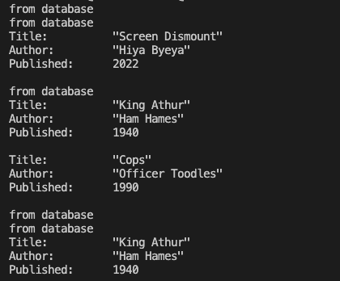
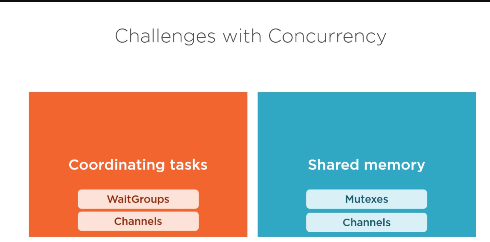
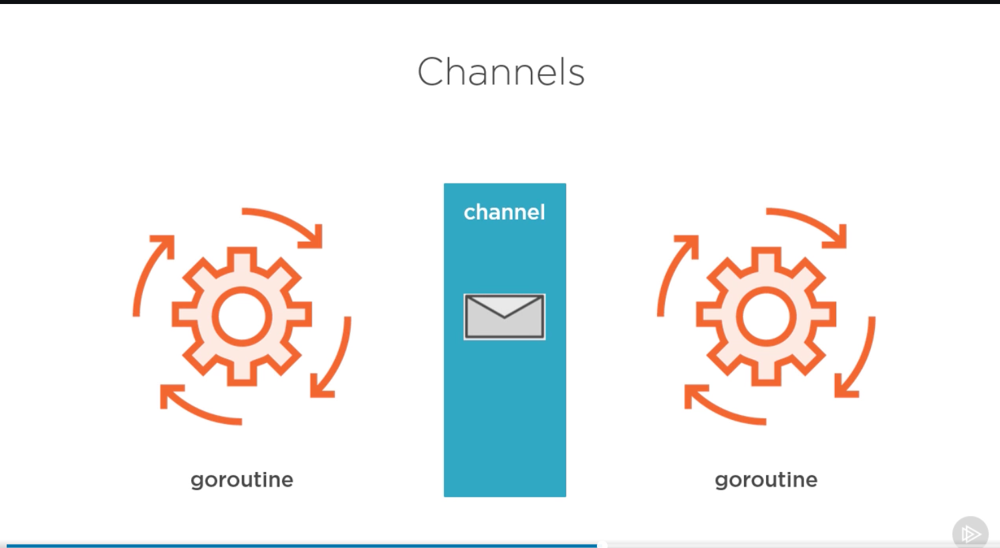
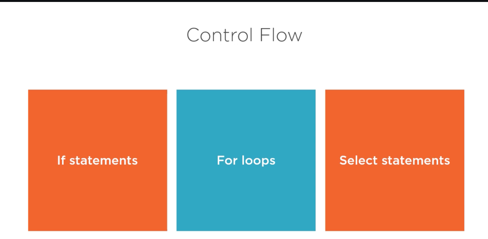

# Credits

All of the learning done here was from the Concurrent Programming with Go
by Mike Van Sickle Plural sight course. [You can find that here](https://app.pluralsight.com/library/courses/concurrent-programming-go/table-of-contents)

Note though, my final product of the code is different than his final product. I didn't like a few things that he had -- it kind of felt like a bad ending to a movie where the movie didn't close the chapters on some of the left overs. I tried to do that myself so be warned.

# Wait Groups

We create a wait group, which is essentially a go routine that is there to track other go routines. This way we can wait on the go routines to finish before we end the program. This way there isn't any tasks trying to complete before the main function returns.

### Create

```go
// Create a wait group object
waitGroup := &sync.WaitGroup{}
```

Before a go routine, make sure to add that go routine to the waitgroup queue:

### Add to queue
```go
waitGroup.Add(1)
```

Now inside of your go routine, we need to tell to waitGroup when the task is done. Do this by:

### Tell the waitGroup our task is done inside the go routine:

```go
waitGroup.Done()
```

Now lets put it all together in a clear picture of creation, awaiting and completion of task(s).

### Full main function

```go
// Don't worry about implementation, just know that 
// each anon function is doing some go routine task
// and that our wait group awaits it
func main() {
	// create a wait group so we can await the go routines to finish
	waitGroup := &sync.WaitGroup{}

	for i := 0; i < 10; i++ {
		// grab a random id
		id := rnd.Intn(10) + 1
		// Add the amount of tasks or go routines that are going to execute each time
		waitGroup.Add(2)
		// wrap if statement with anon func so we can call go routine
		go func(id int, waitGroup *sync.WaitGroup) {
			// query cache first; if id of book is in cache, grab it
            // problem: no mutex = can access same memory space
			if book, ok := queryCache(id); ok {
				fmt.Println("from cache")
				fmt.Println(book.ToString())
			}
			// tells the waitGroup that we created that this task is done
			waitGroup.Done()
		}(id, waitGroup)

		go func(id int, waitGroup *sync.WaitGroup) {
			// query database if book is not in cache
			if book, ok := queryDatabase(id); ok {
				fmt.Println("from database")
				fmt.Println(book.ToString())
			}
			// tells the waitGroup that we created 
            // that this task is done
			waitGroup.Done()
		}(id, waitGroup)
	}

	// wait for all tasks to be done
	waitGroup.Wait()
}
```
### Problems:

We still have two main problems:
- If we want to avoid go routines accessing the same memory we need to add mutexs. !!! Race Condition !!! 

- fmt.Println() is NOT thread safe. So we must use another technique to solve this problem.

# Mutexs

A ***mut***ual ***ex***clusion lock. It used to protect portions of your code. We need to this protect memory access, so that only one go routine can access a piece of code at a time that access some memory. 

Adding this will fix our race conditon we currently have in our program.

We can spot our race condition by throwing the --race flag on a run.

### Spot our race condition

```bash
# order of command matters!
go run --race .
```

### Output:

```bash
from database
WARNING: DATA RACE
Write at 0x00c0002800d8 by goroutine 17:
  main.queryDatabase()
      $PATH/LearnGoConcurrency/main.go:67 +0x104
  main.main.func2()
      $PATH/LearnGoConcurrency/main.go:35 +0x34
  main.main.func4()
      $PATH/LearnGoConcurrency/main.go:41 +0x54

Previous write at 0x00c0002800d8 by goroutine 15:
  main.queryDatabase()
      $PATH/LearnGoConcurrency/main.go:67 +0x104
  main.main.func2()
      $PATH/LearnGoConcurrency/main.go:35 +0x34
  main.main.func4()
      $PATH/LearnGoConcurrency/main.go:41 +0x54

Goroutine 17 (running) created at:
  main.main()
      $PATH/LearnGoConcurrency/main.go:33 +0x4c

Goroutine 15 (running) created at:
  main.main()
      $PATH/LearnGoConcurrency/main.go:33 +0x4c
==================
Title:          "Running Low"
Author:         "Oil Gasoline"
Published:      1830

from database
from database
Title:          "Running Low"
Author:         "Oil Gasoline"
Published:      1830

Title:          "Bunion Onion"
Author:         "Strawberry Pie"
Published:      1410

from database
Title:          "Sloppy Shlop"
Author:         "Shooter Mcgavin"
Published:      1950

from database
Title:          "Cops"
Author:         "Officer Toodles"
Published:      1990

Found 2 data race(s)
exit status 66
```

This is an awesome tool that will spot race conditions in code! The amazing thing about it, is even if we put some time.Sleep() between a read & write of the same data, our program will appear to look just fine, but in reality it's still a race condition. This command will still spot this race condition!

### Solve the problem

Introduce a new mutex object:

```go
mutex := *sync.Mutex()
```

Put the mutex.Lock & Unlock methods before a read & write call so that we don't run into a race condition.

### Lock:

```go
// Lock a function so another routine can't access it
mutex.Lock()
```

### Unlock:

```go
// Unlock a funtion once the go routine is done, so another
// go routine can access it
mutex.Unlock()
```

### In action:
```go
// returns a book & a bookean if exists
func queryCache(id int, mutex *sync.Mutex) (Book, bool) {
	mutex.Lock() // LOCK <------->
	book, ok := cache[id]
	mutex.Unlock() // UNLOCK <------->
	return book, ok
}

func queryDatabase(id int, mutex *sync.Mutex) (Book, bool) {
	// fake time it takes to query a database
	time.Sleep(100 * time.Millisecond)

	// iterate through slice of books defined 
    // in book.go (fake database)
	for _, book := range books {
		// if book id is the same as id provided, means they are the same book...
		if book.ID == id {
			// put the book in the cache
			mutex.Lock() // LOCK <------->
			cache[id] = book // without mutexs go routines will try to write & access this cache at the same time (access the same memory)
			mutex.Unlock() // UNLOCK <------->
			return book, true
		}
	}

	// else return an empty book & say false boolean
	return Book{}, false
}
```

These simple lock and unlock methods ensure that we aren't reading and writing to memory at the same time. We have effecitvely protected our shared memory.

The important part though is that we are allowed to read from memory at the same time another go routine is reading from memory, because all we are doing is indexing the memory. This is not true for writing. We are changing the memory, so we cannot write at the same time that another go routine is writing to that same memory.

SO, we are NOT allowed to 
- read & write from same memory at the same time OR 
- write & write from same memory at the same time.

We ARE allowed to:
- read & read from same memory

In our code, we have innefficiencies. Technically, we will be reading from cache a whole lot more that we are writing to the cache, but in our code we are locking the read portion so that other go routines that are reading CANNOT access this memory. If we had a large application with many users, this would be a problem. 

Lets fix it with read & write mutexs.

### Read & Write Mutexs

Introduce a new read write mutex object:

```go
mutex := *sync.RWMutex()
```

### Read Lock:

```go
// Lock a function so only read mutexs can access
mutex.RLock()
```

### Read Unlock:

```go
// Unlock a funtion once the go routine is done, so another
// write mutex can access
mutex.RUnlock()
```

### Rework of queryCache() function:

```go
// returns a book & a bookean if exists
func queryCache(id int, mutex *sync.RWMutex) (Book, bool) {
	// READ LOCK -- Only reads can access at the same time
    mutex.RLock() 
	book, ok := cache[id]
	mutex.RUnlock()
	return book, ok
}
```

### The queryDatabase function stays the same:

Since we are writing to the shared memory in this function,
we want to use the same mutex.Lock & mutex.Unlock methods.

Essentially, we are using
- mutex.Lock & mutex.Unlock for writes 
- mutex.Rlock & mutex.RUnlock for reads

### Word of caution

RLock & RUnlock are a lot more complicated than the
write Lock and Unlock methods. 

This can cause performance issues if you don't need to use them. Only use Rlock & RUnlock when needed:

- Use RLock & RUnlock when:
    - You are doing a lot more reads than writes to the same memory
- Use Lock & Unlock when:
    - You are doing a balance of reads & writes to the same memory

### Mutex Wrap Up

We solved the problem where we had a race condtion by using mutexes.

We still have a problem where the fmt.Println() function isn't thread safe, so we have to tackle that problem still.

Example of not thread safe fmt.Println() printing "from database" in random places and not before printing of the book:



# Channels

"Don't communicate by sharing memory, share memory by communicating" - Rob Pike

As applications become very large, it can be difficult to protect memory shared by multiple go routines. So we can use channels to fix this.

## Channels vs Mutexs

- Channels:
    - Generate copies of that memory and pass it along in our application
        - One side of the channel will have a sender that will send a message into the channel
        - Then it will be recieved on the other side by a go routine. But the recieved message will be a copy of the message instead of the original message itself so we are not using the same memroy.
- Mutexs:
    - Protect a certain section of memory so that only one operator can manipulate that memory at one time.

The problems that WaitGroups, Mutexes and channels solve. Notice how channels solve both problems:


## How Channels solve both problems:

So all of the methods that we have talked about so far (WaitGroups, Mutexs) are just forms of communcation. They enable the go routines to have some sort of communication. 
- WaitGroups solve the problem of the program ending before all other go routines have finished by basically having one go routine keep track of all the go routines.
- Mutexs communicate by having a goroutine lock a piece of memory so that no one else can write to it. This go routine is telling other go routines that "you cannot access this memory, because I am"

Channels are a litte different. You can think of a channel as the middle man between two go routines. One go routine passed a copy of their message to this channel and then the other go routine will pull that message off and use it elsewhere. This creates a scenario where go routines no longer have to manage the communication. They don't have to know about the other go routines, because they only have to know about the channel:



## Create an unbuffered channel

```go
 ch := make(chan int)
```

Channels should always be passed in by function and not used locally.

## Create an buffered channel

```go
// tells the capacity of the channel upfornt, the internal
// capacity of 5
ch:= make(chan int, 5)
```

Channels are blocking calls, so we must use go routines in order to access the send and recieve portions of our code.

## Why we need go routines for send/recieve in channels

Say we have code that looks like this:
```go
ch := make(chan int)

fmt.Println(<-ch) // blocks on this line because we will be for waiting on a message forever
ch <-42
```

Or even like this:

```go
ch := make(chan int)

ch <-42 // blocks on this line as well
fmt.Println(<-ch)
```

You might think that the second example should work, but we actually have the opposite problem as the first example. We CANNOT put in a message until there is a reciever waiting for the message. We are trying to push a message into the channel, but we can't because nothing is listening for it as we are blocked without go routines.

You have to have a sender and reciever to be able to operate.

## Unbuffered Channel In Action

```go
func main() {
	// create waitgroup
	wg := &sync.WaitGroup{}
	// create channel
	ch := make(chan int)

	// add 2 tasks to wait on
	wg.Add(2)
	// recieve from channel
	go func(ch chan int, wg *sync.WaitGroup) {
		// printing a message from the channel
		// <- indicates we are recieving the message from the channe;
		fmt.Println(<-ch) // go routine sleeps here first
		wg.Done() // finishes AFTER go routine from above awakes when a sender is sending a message over the channel!
	}(ch, wg)

	// send to channel
	go func(ch chan int, wg *sync.WaitGroup) {
		// put the number 42 into the channel
		ch <- 42 // sends message since there is a reciever on the other end
		wg.Done() // finish
	}(ch, wg)
	wg.Wait()
}
```

So here we have a simple application that uses go routines to put a message on a channel and then a reciever that takes the message from the channel in an unbuffered way.

The reason this now works is because when the first go routine trys to print the message from the channel, it notices that there is no sender on the other end of the channel. So it will fall alseep and the go run time will start another go routine to go to the next function. This next function will try to pass 42 into the channel and it notices that it in fact does have a reciever, so it will send the message over the channel and then this go routine will be done.

So because of this, we can actually make our program send to channel first instead of receiving first. This means tjat order does not matter (for sending or recieving first), since the go routines will go to sleep and sort of await each other.

TLDR: You can only send messages on a channel with an active reciever. In our current state, that means we can't send multiple messages at once. A situation like that calls for a buffered channel.

## Simple Buffered Channel Example

In this case, we only need to specify that we need 1 extra space in our buffered channel. The unbuffered channel naturally has zero extra spaces. So here is an example of storing one extra message in the buffer at the same time and then printing both messages.

```go
func main() {
	// create waitgroup
	wg := &sync.WaitGroup{}
	// create channel & can have one message sitting in the channel
	ch := make(chan int, 1)

	// add 2 tasks to wait on
	wg.Add(2)
	// recieve from channel
	go func(ch chan int, wg *sync.WaitGroup) {
		// printing a message from the channel
		// <- indicates we are recieving the message from the channe;
		fmt.Println(<-ch) // prints 42
		fmt.Println(<-ch) // prints 27
		wg.Done()
	}(ch, wg)

	// send to channel
	go func(ch chan int, wg *sync.WaitGroup) {
		// put the number 42 into the channel
		ch <- 42
		ch <- 27 // this fills the one space in our unbuffered channel
		wg.Done()
	}(ch, wg)
	wg.Wait()
}
```

## Channel Types

- Bidirection
    - Created channels are always bidirectional
- Send only
- Recieve only

We create a channel that is bidrectional, but inside our function, we can restrict which way we use this channel.

Channel types created in go:
```go
ch := make(chan int) // created channels are always bidirectional
func myFunction(ch chan int) {...} // bidrectional channel
func myFunction2(ch chan<- int) {...} // send-only channel
func myFunction3(ch <-chan int) {...} // recieve-only channel
```

## Closing Channels

This is useful so that the sender can tell the reciever that we are no longer going to be sending messages so there is nothing to wait for.

Closed channel rules:
- We cannot directly check to see if that channel is closed or not though. Sending a new message in a closed channel will trigger a panic.
- Recieving messages are okay, but:
    - If buffered, all buffered messages available
    - If unbuffered, or buffer empty, receive zero-value
- We can check to see if the channel is closed by using comma okay syntax to check (value, bool)
- Can only close channels on a send, not a recieve
To close a channel, simply:

```go
ch := make(chan int)

close(ch) // close channel
```

### Example

```go
func main() {
	// create waitgroup
	wg := &sync.WaitGroup{}
	// create channel & can have one message sitting in the channel
	ch := make(chan int, 1)

	// add 2 tasks to wait on
	wg.Add(2)
	// recieve from channel
	go func(ch <-chan int, wg *sync.WaitGroup) {
		// printing a message from the channel
		// <- indicates we are recieving the message from the channe;
		fmt.Println(<-ch) // prints 42
		fmt.Println(<-ch) // prints 27

		wg.Done()
	}(ch, wg)

	// send to channel
	go func(ch chan<- int, wg *sync.WaitGroup) {
		// put the number 42 into the channel
		ch <- 42
		//ch <- 27 // this fills the one space in our unbuffered channel
		close(ch)
		wg.Done()
	}(ch, wg)
	wg.Wait()
}
```

Output:

```bash
42
0
```

Lets look at the problem again where if we send something, we must recieve something (and vice versa). What we can actually do (with no real use case) is close a channel on another go routine that is trying to recieve some information. This will make it so that the recieving channel returns two values, a message and a boolean.

### Example of returning expected value:

```go
func main() {
	wg := &sync.WaitGroup{}
	ch := make(chan int)

	wg.Add(2)
	// recieve
	go func(ch <-chan int, wg *sync.WaitGroup) {
		msg, ok := <-ch
		fmt.Println(msg, ok)
		wg.Done()
	}(ch, wg)

	// send
	go func(ch chan<- int, wg *sync.WaitGroup) {
		ch <- 20
		wg.Done()
	}(ch, wg)

	wg.Wait()
}
```

Output:

```bash
20 true
```

### Example of returning a zero unexpectedly on a closed channel:

```go
func main() {
	wg := &sync.WaitGroup{}
	ch := make(chan int)

	wg.Add(2)
	// recieve
	go func(ch <-chan int, wg *sync.WaitGroup) {
		msg, ok := <-ch
		fmt.Println(msg, ok)
		wg.Done()
	}(ch, wg)

	// send
	go func(ch chan<- int, wg *sync.WaitGroup) {
		close(ch) // UNEXPECTED CLOSE
		wg.Done()
	}(ch, wg)

	wg.Wait()
}
```

Output:

```bash
0 false
```

Overall, this allows us to kind of check to see if the channel is closed on the recieving end. It is also good to do this to make sure that if your list can actually contain a zero value, that is valuable so that we can check to see if the zero value is actually something that the closed channel returned or that the go routine sender sent (if it is an int). If the channel was of a different type, say string, then it would return the zero value of that type.

We can then check to see if these values are because of a closed channel or from the actual message by using control flows.

# Control Flow

We will look at how Channels interact with control flows in go



## If statement:

Use an if statement to see if the channel was closed before using the message that was recieved from the channel (the reciever doesn't know if the channel was closed so we have to check):

```go
func main() {
	wg := &sync.WaitGroup{}
	ch := make(chan int)

	wg.Add(2)

	// recieve
	go func(ch <-chan int, wg *sync.WaitGroup) {

		// check channel with if statement
		// if channel is not closed, print message
		if msg, ok := <-ch; ok { // comma ok syntax!!
			fmt.Println(msg, ok)
		} else {
			fmt.Println("The channel was closed and cannot be accessed from.")
		}

		wg.Done()
	}(ch, wg)

	// send
	go func(ch chan<- int, wg *sync.WaitGroup) {
		close(ch) // UNEXPECTED CLOSE
		wg.Done()
	}(ch, wg)

	wg.Wait()
}
```
### Output

```bash
The channel was closed and cannot be accessed from.
```

## For loops:

My comments in the program basically say it all. If using a for in range style of for loop, we must make sure that we close the channel on the sending side.

```go
func main() {
	wg := &sync.WaitGroup{}
	ch := make(chan int)

	wg.Add(2)
	// recieve
	go func(ch <-chan int, wg *sync.WaitGroup) {
		// run a for each
		// the sending function must close the channel when it is done though!
		for msg := range ch {
			fmt.Println(msg)
		}
		wg.Done()
	}(ch, wg)

	// send
	go func(ch chan<- int, wg *sync.WaitGroup) {
		for i := 0; i < 10; i++ {
			ch <- i
		}
		close(ch) // must close here if: we are using the foreach & not explicitly telling how many interations in our for loop
		wg.Done()
	}(ch, wg)

	wg.Wait()
}
```

### Output

```bash
0
1
2
3
4
5
6
7
8
9
```

## Select Statement

- Similar to switch statements, but they are specific to channels
- Select statements differ by
    -  instead of checking on a condition, we are actually doing to try and send or recieve messages
    - There is no predetermined order of a select statement, if more than one case CAN be acted upon at the same time


### Example without output

```go
ch1 := make(chan int)

ch2 := make(chan string)

select{
    case i := <-ch1:

    case ch2 <- "hello":

    default:
        // use default case for non-blocking select
}
```


### Using all constructs together

Here is the original main function that uses the books again. I optimized this to my liking, as the plural sight tutorial that I used for this program wanted to query the cache & database, even if the cache was hit. So I formatted the code to look like this, with the big note that I increased the fake delay for querying the database to make sure that the cache is working correctly as you can no longer know which data is coming from the cache or the database.

The plural sight instructor's end program also contained a sleep function as well which I didn't like, so I refactored the code so I no longer needed to await the printing of the books.

```go
func main() {

	// create a wait group so we can await the go routines to finish
	waitGroup := &sync.WaitGroup{}

	// create a read write mutex to fix race conditions
	mutex := &sync.RWMutex{}

	ch := make(chan Book) // channel used for cached book objects
	//dbCh := make(chan Book)    // channel used for db book objects

	// query database 10 times with each time querying a random id
	for i := 0; i < 10; i++ {
        // grab a random id
        id := rnd.Intn(10) + 1
        // Add the amount of tasks or go routines that are going to execute each time
        waitGroup.Add(2)
        // wrap if statement with anon func so we can call go routine
        go func(id int, waitGroup *sync.WaitGroup, m *sync.RWMutex, ch chan<- Book) {
            // query cache first; if id of book is in cache, grab it
            if book, ok := queryCache(id, m); ok {
                ch <- book
            } else {
                if book, ok := queryDatabase(id, m); ok {
                    m.Lock()
                    cache[id] = book
                    m.Unlock()
                    ch <- book
                }
            }
            // tells the waitGroup that we created that this task is done
            waitGroup.Done()
        }(id, waitGroup, mutex, ch)

        // create on go routine per query to handle the response
        go func(channel <-chan Book) {
            select {
            case book := <-channel:
                fmt.Println(book)
            }
            waitGroup.Done()
        }(ch)

        waitGroup.Wait()
    }

    // wait for all tasks to be done

}

// returns a book & a bookean if exists
func queryCache(id int, mutex *sync.RWMutex) (Book, bool) {
	mutex.RLock()
	book, ok := cache[id]
	mutex.RUnlock()
	return book, ok
}

func queryDatabase(id int, mutex *sync.RWMutex) (Book, bool) {
	// fake time it takes to query a database
	time.Sleep(3000 * time.Millisecond)

	// iterate through slice of books defined in book.go
	for _, book := range books {
		// if book id is the same as id provided, means they are the same book...
		if book.ID == id {
			// put the book in the cache
			mutex.Lock()
			cache[id] = book // without mutexs go routines will try to write & access this cache at the same time (access the same memory)
			mutex.Unlock()
			return book, true
		}
	}

	// else return an empty book & say false boolean
	
```
